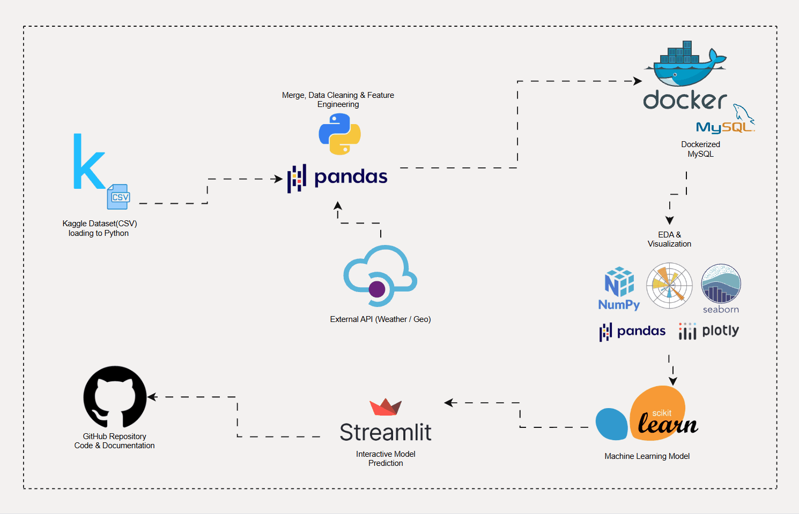

# 🏨 Hotel Booking Cancellation Prediction (End-to-End Project)
---
**Streamlit App:** [https://hotel-booking-analysis-and-prediction-hbpea2024.streamlit.app/](https://hotel-booking-analysis-and-prediction-hbpea2024.streamlit.app/)
## 📌 Project Overview
This project is an end-to-end data science solution designed to predict the likelihood of hotel booking cancellations. It integrates external **Weather API** data to enhance predictive power and features a user-friendly **Streamlit** dashboard for real-time predictions.

### 📊 Dataset at a Glance
* **Initial Data:** ~120,000 rows & 43 columns.
* **Final Processed Data:** ~118,000 rows & 27 high-impact features.
* **Target Variable:** `is_canceled` (Binary: 0 for stayed, 1 for canceled).

---

## 🔄 Project Workflow
The following animation illustrates the technical flow from data acquisition via API to model deployment:

---

## 🔍 EDA: Key Insights (Q&A)
During the analysis, I extracted several critical findings from the data:

* **Q: Does weather (temp, rain, snow) directly cause cancellations?**
    * **A:** No, there is no strong direct correlation. However, seasonal analysis reveals that unexpected bad weather during peak months significantly increases the cancellation rate.
* **Q: What is the impact of "Days in Waiting List"?**
    * **A:** There is a clear positive correlation. The longer a guest stays on the waiting list, the higher the risk of cancellation.
* **Q: Do hotel types, countries, and agents influence the outcome?**
    * **A:** Yes. City Hotels exhibit higher cancellation rates compared to Resort Hotels. Additionally, certain countries and specific agents show extremely strong correlations with cancellation behavior.
* **Q: Are repeated guests more loyal?**
    * **A:** Surprisingly, no. Many repeated guests have a high count of previous cancellations, leading to a higher cancellation rate. Conversely, guests with a history of "previous bookings not cancelled" show a much lower risk.

---

## 🛠 Feature Engineering & Cleaning
To optimize the model, I performed:
* **Data Cleaning:** Removed redundant and highly correlated columns.
* **Categorical Encoding:** Grouped rare values into an **"Other"** category and applied **One-Hot Encoding (OHE)** to convert nominal categorical variables for model compatibility.
* **New Features:** Created high-value columns like `same_room` (reserved vs. assigned), `hotel_type`, `total_stays`, and `people`.

---

## 🤖 Machine Learning & Performance

I utilized a **Random Forest Classifier** to build the predictive model. The training process included:
* **Data Split:** **75% Train** / **25% Test** split.
* **Categorical Handling:** All categorical nominal features were transformed using **One-Hot Encoding**.
* **Validation:** A **5-fold Cross-Validation** was performed to ensure the model generalizes well and to check for potential overfitting.

### 📈 Evaluation Metrics
| Metric | Training Score | Testing Score |
| :--- | :--- | :--- |
| **Accuracy** | 0.894 | **0.863** |
| **F1-Score** | 0.850 | **0.803** |
| **Precision** | 0.881 | **0.842** |
| **Recall** | 0.822 | **0.768** |

> *The close alignment between training and testing scores confirms the model's stability and its ability to generalize to unseen data.*

---

## 💻 Streamlit App & Prediction
The final model is integrated into a Streamlit interface to provide an interactive experience:

* **Feature Importance:** Users can visually see which factors most significantly influence the model's decision-making process.
* **Real-Time Prediction:** By inputting specific booking details, users can get an instant prediction on whether a booking is likely to be cancelled.

---

